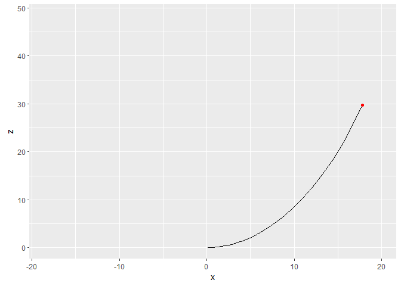

# Lorenz Attractor
 Different ways to represent Lorenz attractor!

 This system presents chaotic behaviour and it's popularly known as butterfly effect.

 The project was created for the Scientific Programming in R Language course.

  